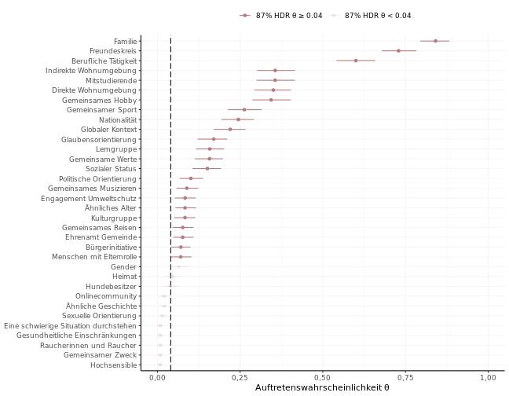
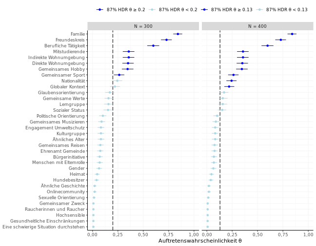

# Get Started

Now that you have gone through the installation procedure,
let's see what you can do with `frankmakrdiss`.
We begin with attaching the package
and setting the number of computer cores
dedicated to the Bayesian modeling.
For this example we will set the number of cores
to the default number of parallel MCMC chains in *Stan*.


```r
library(frankmakrdiss)
options(mc.cores = 4)
```

On attaching the package
there are some checks,
if `CmdStan` and `cmdstanr` are properly installed.
Remember, they are not on *CRAN*.
If everything looks good
we can continue with a first example:
Reproducing figure 12.6 from the doctoral dissertation.
Please note that you should not expect *exact reproducibility*
due to the external constraints mentioned in the
[Stan reference manual](
https://mc-stan.org/docs/2_32/reference-manual/reproducibility.html).

## Reproducing figure 12.6

By looking in the doctoral dissertation
we know that figure 12.6 is based on model 12.2
from the first study.
The package help shows
which variables we need to use.


```r
?comms_demo
?comms_data
?stan_dissmodel
```

To prepare the data
we build a named list with the relevant variables.


```r
standat_f12.6 <- list(
  K = length(levels(comms_data$k_iter3)),
  N = nrow(comms_demo),
  y = tabulate(comms_data$k_iter3),
  L = 5,
  N_tilde = seq(from = 200, to = 1000, by = 200)
  )
```

It's time to fit the model.


```r
fit_f12.6 <- stan_dissmodel(model_number = "12.2", stan_data = standat_f12.6)
#> Model executable is up to date!
#> Running MCMC with 4 parallel chains...
#> 
#> Chain 1 Iteration:    1 / 2000 [  0%]  (Warmup) 
#> Chain 2 Iteration:    1 / 2000 [  0%]  (Warmup) 
#> Chain 3 Iteration:    1 / 2000 [  0%]  (Warmup) 
#> Chain 4 Iteration:    1 / 2000 [  0%]  (Warmup) 
#> Chain 1 Iteration:  500 / 2000 [ 25%]  (Warmup) 
#> Chain 3 Iteration:  500 / 2000 [ 25%]  (Warmup) 
#> Chain 2 Iteration:  500 / 2000 [ 25%]  (Warmup) 
#> Chain 4 Iteration:  500 / 2000 [ 25%]  (Warmup) 
#> Chain 1 Iteration: 1000 / 2000 [ 50%]  (Warmup) 
#> Chain 1 Iteration: 1001 / 2000 [ 50%]  (Sampling) 
#> Chain 2 Iteration: 1000 / 2000 [ 50%]  (Warmup) 
#> Chain 2 Iteration: 1001 / 2000 [ 50%]  (Sampling) 
#> Chain 3 Iteration: 1000 / 2000 [ 50%]  (Warmup) 
#> Chain 3 Iteration: 1001 / 2000 [ 50%]  (Sampling) 
#> Chain 4 Iteration: 1000 / 2000 [ 50%]  (Warmup) 
#> Chain 4 Iteration: 1001 / 2000 [ 50%]  (Sampling) 
#> Chain 1 Iteration: 1500 / 2000 [ 75%]  (Sampling) 
#> Chain 2 Iteration: 1500 / 2000 [ 75%]  (Sampling) 
#> Chain 3 Iteration: 1500 / 2000 [ 75%]  (Sampling) 
#> Chain 4 Iteration: 1500 / 2000 [ 75%]  (Sampling) 
#> Chain 1 Iteration: 2000 / 2000 [100%]  (Sampling) 
#> Chain 1 finished in 0.6 seconds.
#> Chain 2 Iteration: 2000 / 2000 [100%]  (Sampling) 
#> Chain 3 Iteration: 2000 / 2000 [100%]  (Sampling) 
#> Chain 2 finished in 0.7 seconds.
#> Chain 3 finished in 0.7 seconds.
#> Chain 4 Iteration: 2000 / 2000 [100%]  (Sampling) 
#> Chain 4 finished in 0.9 seconds.
#> 
#> All 4 chains finished successfully.
#> Mean chain execution time: 0.7 seconds.
#> Total execution time: 1.0 seconds.
```

After fitting the model
we should check the sampling diagnostics.


```r
fit_f12.6$cmdstan_diagnose()
#> Processing csv files: ...
#> 
#> Checking sampler transitions treedepth.
#> Treedepth satisfactory for all transitions.
#> 
#> Checking sampler transitions for divergences.
#> No divergent transitions found.
#> 
#> Checking E-BFMI - sampler transitions HMC potential energy.
#> E-BFMI satisfactory.
#> 
#> Effective sample size satisfactory.
#> 
#> Split R-hat values satisfactory all parameters.
#> 
#> Processing complete, no problems detected.
```

For later reuse
we can save the fitted model
in the active working directory or any other location.


```r
fit_f12.6$save_object(file = "fit_f12.6.rds")
```

Now that we have the posterior distribution
of the parameters we are interested in
we can make the `ggplot2` graph.
For each graph a corresponding function to prepare the data frame
is exported.
So we can also easily adapt the graphs to a new style.


```r
?make_thetapointrange
?plot_thetapointrange
```


```r
plotdat_f12.6 <- make_thetapointrange(
  fit_f12.6$draws("theta", format = "draws_matrix"),
  probs = 0.87, n_group_tilde = 40, n_sample_tilde = 1000)
```


```r
plot_thetapointrange(plotdat_f12.6)
```



## Adapting figure 12.6

Let's suppose
we're planning a similar study with the same target population.
But because of strict time restrictions
we would expect a sample size of rather 150 or 250 than 1000.
Under these constraints,
what are the expected probabilities for a minimum group size of 40?

We already fit the model so all we need is new plot data.
But now we want a figure
with the two expected sample sizes shown
side by side.
Therefore we first build a list of two data frames with the new plot data.


```r
plotdat_f12.6_list <- lapply(c(200, 300), function(i)
  make_thetapointrange(
  fit_f12.6$draws("theta", format = "draws_matrix"),
  probs = 0.87, n_group_tilde = 40, n_sample_tilde = i)
  )
```

To show the differences side by side
we will use `ggplot2::facet_wrap`.
First we have to add a new column
to each data frame in the list
indicating the facets.
Then we `rbind` the data frames.


```r
plotdat_f12.6_fac <- do.call(rbind,
  sapply(1:2, function(i) data.frame(
    plotdat_f12.6_list[[i]],
    fac = factor(i, levels = 1:2, labels = c("N = 300", "N = 400"))),
    simplify = FALSE)
  )
```

We want to change the `ggplot2` graph.
Because we haven't attached `ggplot2` yet
we need to refer to a function in `ggplot2` with an explicit `ggplot2::`.
In addition to the facets
we want change the colors, too.
All we have to do
is adding the layers to the plot.


```r
plot_thetapointrange(plotdat_f12.6_fac) +
  ggplot2::scale_color_manual(values = rep(c("blue", "lightblue"), 2)) +
  ggplot2::facet_wrap(ggplot2::vars(fac))
#> Scale for colour is already present.
#> Adding another scale for colour, which will replace the existing scale.
```


